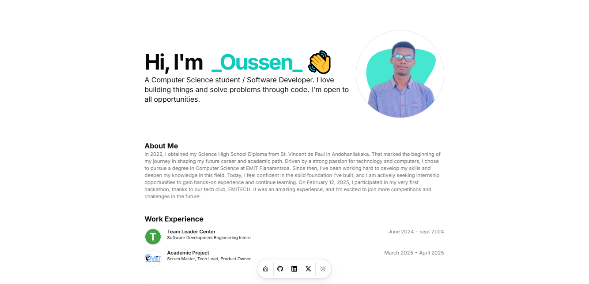

# Houssen's Portfolio

[](./Portfolio.PNG)

Visit the live portfolio: [houssenaly.vercel.app](https://houssenaly.vercel.app)

---

This is my personal portfolio website, showcasing my projects, experience, and background. Built with Next.js, styled using TailwindCSS, and powered by Magic for authentication, the site is designed for performance, accessibility, and a modern developer experience.

---

## Features

- **Modern UI:** Built with [Next.js](https://nextjs.org/) and [TailwindCSS](https://tailwindcss.com/) for fast, responsive design.
- **Magic Authentication:** Secure, passwordless authentication with [Magic](https://magic.link/).
- **Project Highlights:** Displays selected and recent projects.
- **Contact & About:** Simple ways to reach out and learn more about me.
- **SEO Optimized:** Optimized for search engines and social sharing.

---

## Getting Started

### Prerequisites

- [Node.js](https://nodejs.org/) (v16+)
- [npm](https://www.npmjs.com/) or [yarn](https://yarnpkg.com/)

### Installation

1. **Clone the repository:**
   ```bash
   git clone https://github.com/alyhoussen/houssens-portfolio.git
   cd houssens-portfolio
   ```

2. **Install dependencies:**
   ```bash
   npm install
   # or
   yarn install
   ```

3. **Set up environment variables:**  
   Copy `.env.example` to `.env.local` and provide your Magic publishable key and other required variables.

4. **Run the development server:**
   ```bash
   npm run dev
   # or
   yarn dev
   ```

5. **View the site:**  
   Visit [http://localhost:3000](http://localhost:3000) in your browser.

---

## Project Structure

```
houssens-portfolio/
├── pages/
├── components/
├── public/
├── styles/
├── screenshot.png
├── tailwind.config.js
├── next.config.js
└── ...
```

---

## Tech Stack

- [Next.js](https://nextjs.org/)
- [TailwindCSS](https://tailwindcss.com/)
- [Magic](https://magic.link/) (Authentication)

---

## Contributing

Feel free to open issues or pull requests for suggestions and improvements!

---

## License

MIT License © 2025 Aly Houssen
